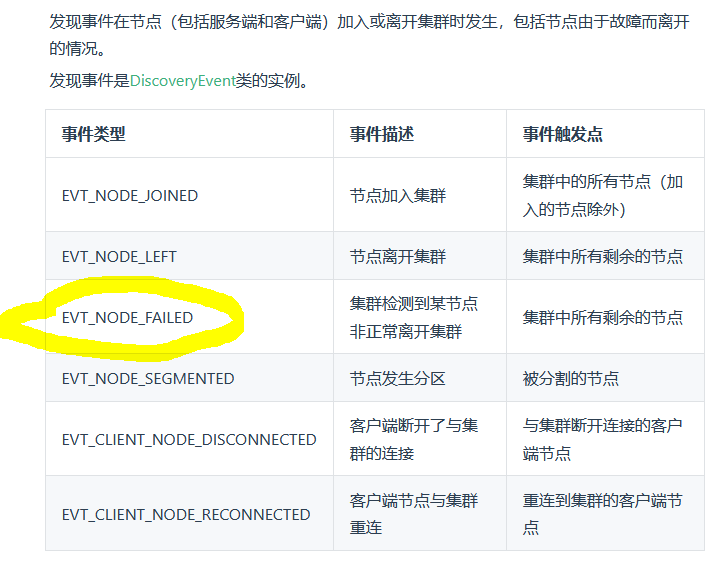

# Ignite集群节点事件监听测试
针对DiscoveryEvent类型事件

主要测试EVT_NODE_FAILED事件在什么时候触发？

## 猜测
EVT_NODE_FAILED事件描述说“集群检测到某节点非正常离开集群”，无非是一些不确定因素：比如cpu、内存使用率,网络可达性等等

## 走个demo：
分别启动IgniteServer1和IgniteServer2模拟集群中的两个实例
IgniteServer1: 额外启动集群事件监听线程（EventListener）
IgniteServer2: 额外启动集群事件监听线程（EventListener）和oom线程（OomRunner、模拟非正常情况节点挂掉）

1、启动IgniteServer1

2、启动IgniteServer2
设置jvm最大最小堆为20M方便oom

节点2加入集群的事件被节点1监听到了

随后启动IgniteServer2出现了oom挂掉

IgniteServer1监听到了EVT_NODE_FAILED事件

## 结论
基本可以证明上面的猜测，一些不确定因素：比如cpu、内存使用率,网络可达性等等原因导致的节点挂掉会引起Ignite集群的EVT_NODE_FAILED事件；cpu使用属于操作系统控制不好测，大概也是这个逻辑

## 注意
所以在项目中使用ignite的分布式能力来做集群内节点自发现时要注意监听事件不能只监听EVT_NODE_JOINED、EVT_NODE_LEFT，还有异常退出引起的EVT_NODE_FAILED事件；除了这三个也还有其他场景的事件有需要都加上。不然集群事件的监听漏了可能或引起一些分布式的业务问题
